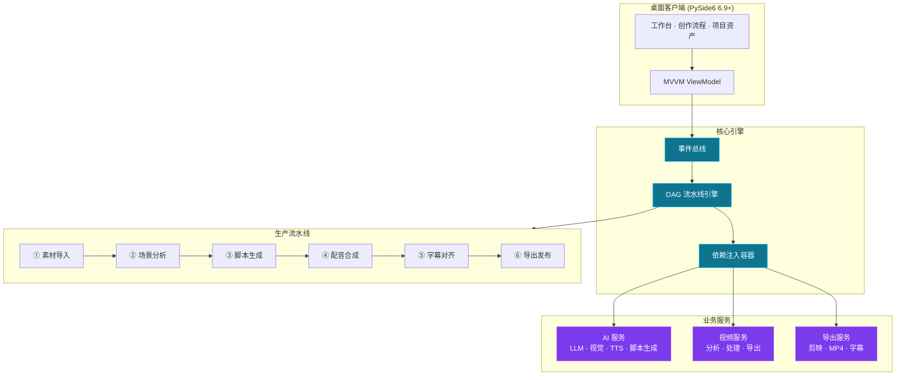

<div align="center">


# SceneFab · AI 影视解说视频创作工具

> **从素材理解、脚本生成、配音合成到多平台导出，一站式自动化生产流程**

[](https://github.com/Agions/scene-fab/releases)
[](https://www.python.org/)
[](https://doc.qt.io/qtforpython/)
[](https://ffmpeg.org/)
[](LICENSE)

[](https://github.com/Agions/scene-fab/actions)
[](https://agions.github.io/scene-fab/)
[](https://github.com/Agions/scene-fab/stargazers)
[](https://github.com/Agions/scene-fab/issues)

[**在线文档**](https://agions.github.io/scene-fab/) · [**下载安装**](https://github.com/Agions/scene-fab/releases) · [**快速开始**](#快速开始) · [**报告问题**](https://github.com/Agions/scene-fab/issues/new?template=bug_report.md) · [**功能建议**](https://github.com/Agions/scene-fab/discussions)

</div>

---

## 🎬 它是什么？

**SceneFab** 是一款面向影视和短剧**第一人称解说**的 AI 视频创作工具。它将视频理解、脚本生成、配音合成、字幕装配和平台导出串成标准化流程，支持从单集创作到整季批量生产的完整链路。

系统围绕 **DAG 并行流水线引擎** 构建，采用事件驱动架构，支持 10+ 个 LLM 提供商和多平台导出预设。

### 解决什么问题？

| 痛点 | SceneFab 方案 |
|------|---------------|
| 🎞️ 视频拆条全靠手工打点，效率低 | AI 智能语义拆条（Qwen2.5-VL），按情节自动切分 |
| 📝 写脚本要理解人物关系 + 桥段 + 节奏 | 剧情图谱 + 桥段识别 + 第一人称 Hook→主体→钩子结构 |
| 🎙️ 配音成本高、音色不一致 | Edge-TTS 多音色 + F5-TTS 音色克隆，本地运行 |
| ⏱️ 字幕和配音对不齐 | 50ms 精度时间戳对齐，偏差 < 50ms 验收标准 |
| 📱 多平台导出参数杂 | 8 平台预设（抖音/B站/小红书/YouTube/TikTok...），一键导出 |
| 📚 短剧整季批量生产成本高 | 整季批量 + 断点续传 + 并行 worker + 实时进度追踪 |

---

## 🚀 核心能力

<table>
  <tr>
    <td align="center" width="33%">
      <h3>🎬 AI 视频理解</h3>
      <p>场景分析 · 人物识别 · 情绪峰值检测<br/>桥段识别 · StoryGraph 剧情图谱</p>
    </td>
    <td align="center" width="33%">
      <h3>📝 第一人称脚本</h3>
      <p>Hook 改写 · 桥段模板 · 多模型复核<br/>字数约束 · 风格预设（7 种）</p>
    </td>
    <td align="center" width="33%">
      <h3>🎙️ 智能配音合成</h3>
      <p>Edge-TTS 多音色 · F5-TTS 克隆<br/>50ms 时间戳对齐 · 音量稳定</p>
    </td>
  </tr>
  <tr>
    <td align="center">
      <h3>📐 字幕装配</h3>
      <p>SRT/ASS 双格式 · 安全区控制<br/>样式保留 · 多平台适配</p>
    </td>
    <td align="center">
      <h3>📱 多平台导出</h3>
      <p>8 平台预设 · H.264/H.265<br/>剪映草稿 JSON · MP4 直出</p>
    </td>
    <td align="center">
      <h3>🔄 批量生产</h3>
      <p>整季批量 · 断点续传 · 并行 worker<br/>实时进度 · 失败重试</p>
    </td>
  </tr>
</table>

---

## ⚡ 快速开始

### 📥 安装 SceneFab

#### 方式一：下载安装包（推荐新手）

从 [Releases](https://github.com/Agions/scene-fab/releases) 下载对应平台的安装包：

| 平台 | 文件 | 系统要求 |
|------|------|----------|
| Windows | `SceneFab-Setup-x.x.x.exe` | Windows 10+ |
| macOS | `SceneFab-x.x.x.dmg` | macOS 11+ (Apple Silicon / Intel) |
| Linux | `SceneFab-x.x.x.AppImage` | Ubuntu 20.04+ / glibc 2.31+ |

#### 方式二：pip 安装（推荐开发者）

```bash
# 1. 安装 SceneFab
pip install scenefab

# 2. 验证 FFmpeg（必需依赖）
ffmpeg -version
# 应输出：ffmpeg version 6.x ...

# 如果未安装 FFmpeg：
brew install ffmpeg          # macOS
sudo apt install ffmpeg      # Ubuntu/Debian
winget install ffmpeg        # Windows
```

### ⚙️ 配置 AI 服务

编辑 `config/llm.yaml`，填入至少一个 API Key：

```yaml
LLM:
  default_provider: "deepseek"

  deepseek:
    enabled: true
    api_key: "sk-your-deepseek-key"
    model: "deepseek-v4-pro"

  qwen:
    enabled: true
    api_key: "sk-your-qwen-key"
    model: "qwen3.7-max"
```

或使用环境变量（更安全）：

```bash
export DEEPSEEK_API_KEY="sk-your-deepseek-key"
export QWEN_API_KEY="sk-your-qwen-key"
```

### ▶️ 启动 SceneFab

```bash
# 启动 GUI（默认）
scenefab

# 查看版本
scenefab --version

# 查看帮助
scenefab --help
```

详细说明请参阅 [在线文档 - 快速开始](https://agions.github.io/scene-fab/guide/quick-start)。

---

## 🏗️ 技术架构

SceneFab 采用**事件驱动的 DAG 并行流水线**架构，每个模块职责清晰、易于扩展：



### 关键设计决策

- **MVVM 架构** — UI 与业务逻辑解耦（v2.4.0 全面 ViewModel 化）
- **事件驱动** — 解耦模块通信，所有状态变更可追溯
- **DAG 流水线** — 支持并行执行和断点续传
- **插件化** — LLM / TTS / 视觉模型均可热插拔
- **本地优先** — 视频数据不出本机，仅 AI 调用走云端

---

## 🛠️ 技术栈

| 组件 | 技术选型 | 用途 |
|------|----------|------|
| 桌面端 | PySide6 6.9+ | Qt 跨平台 GUI |
| 视频处理 | FFmpeg 6.x · OpenCV · MoviePy | 音视频分析与合成 |
| AI 推理 | OpenAI SDK · google-generativeai | LLM 和视觉模型调用 |
| 语音合成 | Edge-TTS · F5-TTS | 解说配音生成 |
| 场景检测 | PySceneDetect | 视频场景自动分割 |
| 数据验证 | Pydantic 2.5+ | 结构化数据校验 |
| 配置管理 | PyYAML · python-dotenv | YAML/环境变量配置 |
| 安全 | cryptography · keyring | API 密钥加密存储 |
| HTTP API | FastAPI · uvicorn | 可选 REST API 服务 |

---

## 📁 项目结构

```
scene-fab/
├── src/scenefab/              # 主包
│   ├── core/                  # 基础设施（事件总线 · DI · 审计 · 流水线引擎）
│   ├── models/                # 数据模型（项目 · 视频 · 叙述 · 媒体）
│   ├── services/              # 业务服务
│   │   ├── ai/                # AI 服务（LLM · 视觉 · TTS · 脚本生成）
│   │   ├── video/             # 视频服务（分析 · 处理 · 导出）
│   │   ├── export/            # 导出服务（剪映 · MP4 · 字幕）
│   │   └── video_tools/       # 视频工具（FFmpeg · 探测 · 硬件加速）
│   ├── pipeline/              # 生产流水线（状态机 · 步骤 · 评估）
│   ├── plugins/               # 插件系统（加载 · 注册 · 接口）
│   ├── api/                   # HTTP API（FastAPI 路由）
│   ├── ui/                    # 用户界面（PySide6 页面 · 主题）
│   └── utils/                 # 工具函数（安全 · 版本 · 日志）
├── tests/                     # 测试套件
├── docs/                      # VitePress 文档站
├── assets/                    # 品牌资源（logo · 徽章）
├── resources/                 # 应用资源（图标 · 样式）
├── scripts/                   # 构建/工具脚本
└── config/                    # 配置文件
```

---

## 📚 文档导航

| 文档 | 说明 |
|------|------|
| [在线文档](https://agions.github.io/scene-fab/) | 完整文档中心（VitePress） |
| [快速开始](https://agions.github.io/scene-fab/guide/quick-start) | 3 步安装、配置和首次运行 |
| [安装指南](https://agions.github.io/scene-fab/guide/installation) | 各平台完整安装步骤 |
| [AI 配置](https://agions.github.io/scene-fab/guide/ai-configuration) | 多服务商配置详解 |
| [CLI 参考](https://agions.github.io/scene-fab/guide/cli-reference) | 命令行使用说明 |
| [Python API](https://agions.github.io/scene-fab/guide/python-api) | Python API 完整文档 |
| [生产规范](https://agions.github.io/scene-fab/guide/first-person-narration-production) | 第一人称解说完整生产流程 |
| [AI 工作流](https://agions.github.io/scene-fab/guide/ai-video-guide) | 从视频到成片的 AI 流程详解 |
| [导出发布](https://agions.github.io/scene-fab/guide/exporting) | 导出格式与平台预设 |
| [疑难排查](https://agions.github.io/scene-fab/guide/troubleshooting) | 常见问题解决 |

---

## 🗺️ 路线图

### ✅ v2.4.0（2026-07-01）— UI 架构升级

- [x] **Phase 1** — UI 模块化分层（净 -1536 行死代码）
- [x] **Phase 2** — ViewModel 化拆分
- [x] **Phase 3** — 暗色主题 + 运行时切换端到端
- [x] **品牌重塑** — 双色调 logo 系统 + OG image + 渲染 pipeline

### 🚧 v2.5.0（计划中）

- [ ] **drag-drop 文件拖拽**（`AssetsPage` 的 `dragEnterEvent`/`dropEvent`）
- [ ] **ViewModel 严格分层**（移除 `TYPE_CHECKING` hack, viewmodel 不再依赖 UI 类型）
- [ ] **macOS 公证**（解决 Gatekeeper 拦截）
- [ ] **批量生产 UI**（整季批量可视化调度）

### 💡 v3.0.0（远期）

- [ ] **Web 版本** — Tauri 重写桌面端 + Web 端复用核心
- [ ] **多人协作** — 云端项目同步 + 团队权限
- [ ] **AI 实时预览** — 边生成边预览，减少等待焦虑
- [ ] **插件市场** — 第三方 LLM / TTS / 视觉模型接入

---

## 🤝 贡献

欢迎贡献代码、报告问题或提出建议。

### 开发环境

```bash
# 克隆仓库
git clone https://github.com/Agions/scene-fab.git
cd scene-fab

# 安装开发依赖
pip install -e ".[dev]"

# 运行测试
make test

# 代码检查
make lint

# 格式化
make format
```

### 提交规范（Conventional Commits）

| 类型 | 用途 | 示例 |
|------|------|------|
| `feat` | 新功能 | `feat(pipeline): add batch production support` |
| `fix` | Bug 修复 | `fix(ai): handle Qwen API timeout gracefully` |
| `docs` | 文档变更 | `docs(readme): update installation steps` |
| `style` | 代码格式（无逻辑变更） | `style(ui): fix indentation in HomePage` |
| `refactor` | 代码重构 | `refactor(core): split event bus into modules` |
| `perf` | 性能优化 | `perf(video): cache scene analysis results` |
| `test` | 测试相关 | `test(services): add e2e for export pipeline` |
| `chore` | 构建/工具 | `chore(deps): bump PySide6 to 6.9` |

提交前请运行 `make lint` 和 `make test`。

### 问题反馈

- 🐛 [Bug 报告](https://github.com/Agions/scene-fab/issues/new?template=bug_report.md)
- 💡 [功能建议](https://github.com/Agions/scene-fab/issues/new?template=feature_request.md)
- 💬 [讨论区](https://github.com/Agions/scene-fab/discussions)

---

## 🙏 致谢

SceneFab 的诞生离不开以下开源项目：

- [PySide6](https://doc.qt.io/qtforpython/) — Qt 官方 Python 绑定
- [FFmpeg](https://ffmpeg.org/) — 跨平台音视频处理
- [Edge-TTS](https://github.com/rany2/edge-tts) — 免费高质量 TTS
- [F5-TTS](https://github.com/SWivid/F5-TTS) — 开源音色克隆
- [PySceneDetect](https://www.scenedetect.com/) — 视频场景检测
- [Pydantic](https://pydantic-docs.helpmanual.io/) — 数据验证
- [VitePress](https://vitepress.dev/) — 文档站框架

---

## 📄 许可证

[MIT License](LICENSE) © 2025-2026 [Agions](https://github.com/Agions)

---

<div align="center">

**[⭐ Star](https://github.com/Agions/scene-fab)** · **[🍴 Fork](https://github.com/Agions/scene-fab/fork)** · **[📖 文档](https://agions.github.io/scene-fab/)** · **[📝 更新日志](CHANGELOG.md)**

<sub>SceneFab v2.4.0 · Made with ❤️ by [Agions](https://github.com/Agions) and [contributors](https://github.com/Agions/scene-fab/graphs/contributors)</sub>

</div>