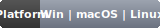

<div align="center">

<br/>

# SceneFab · AI 影视解说视频创作工具

> **上传一部电影 → AI 自动完成语义拆条、解说稿、配音、字幕、合成导出**
> 从「几天一条」变成「一天十条」。

[](LICENSE)
[](https://www.python.org/)
[](https://qt.io/)
[](https://github.com/Agions/scene-fab/releases)
[](https://github.com/Agions/scene-fab/releases)

[**在线文档**](https://agions.github.io/scene-fab/) · [**下载安装**](https://github.com/Agions/scene-fab/releases) · [**报告问题**](https://github.com/Agions/scene-fab/issues/new) · [**功能建议**](https://github.com/Agions/scene-fab/discussions)

</div>

---

## 它是什么？

**SceneFab** 是为自媒体解说创作者打造的 **AI 影视解说视频一站式创作工具**。上传一部电影或短剧，AI 自动理解视频语义、按情节拆条、生成第一人称解说稿、合成情感化配音、对齐字幕、最终输出带解说的完整视频。整条流水线 **5-15 分钟/条**，**成本 < ¥0.01/条**，**视频文件永不上传云端**（全本地处理）。

## 核心能力

<table>
  <tr>
    <td align="center" width="33%">
      <h3>🎬 AI 语义拆条</h3>
      <p><b>Qwen2.5-VL 视觉理解</b><br/>自动识别场景边界、人物动作、对话起止，按情节/叙事单元切分，无需手动打点</p>
    </td>
    <td align="center" width="33%">
      <h3>🎭 情感峰值选段</h3>
      <p><b>视觉 × 音频双维评分</b><br/>画面信息密度 + 语调变化，优先挑选叙事高潮片段，让解说更抓人</p>
    </td>
    <td align="center" width="33%">
      <h3>✍️ AI 解说稿生成</h3>
      <p><b>DeepSeek-V4 · 7 种情感风格</b><br/>纪录片 / 剧情 / 搞笑 / 悬疑… 第一人称视角，词级时间戳自动对齐</p>
    </td>
  </tr>
  <tr>
    <td align="center"><h3>🎙️ 一键配音合成</h3>
      <p><b>Edge-TTS · F5-TTS</b><br/>50ms 精度字幕对齐，零样本音色克隆，主流低延迟与高品质兼顾</p>
    </td>
    <td align="center"><h3>📦 多格式导出</h3>
      <p><b>H.264 / H.265 MP4 · 剪映草稿</b><br/>直出发布平台，或导出原生 JSON 继续精剪，无缝对接现有工作流</p>
    </td>
    <td align="center"><h3>💻 命令行原生</h3>
      <p><b>pip install 即用</b><br/>提供完整 CLI，<code>SKILL.md</code> 支持 Agent 工作流接入（OpenCode / Claude Code / Hermes）</p>
    </td>
  </tr>
</table>

## 快速开始

### 下载安装

| 平台 | 架构 | 文件 |
|------|------|------|
| **Windows** | x64 | [SceneFab-1.1.0-win-x64.exe](https://github.com/Agions/scene-fab/releases/latest) |
| **macOS**   | Apple Silicon | [SceneFab-1.1.0-mac-arm64.dmg](https://github.com/Agions/scene-fab/releases/latest) |
| **macOS**   | Intel | [SceneFab-1.1.0-mac-x64.dmg](https://github.com/Agions/scene-fab/releases/latest) |
| **Linux**   | x64 | [SceneFab-1.1.0-linux-x64.AppImage](https://github.com/Agions/scene-fab/releases/latest) |

> 📦 也可从源码安装（推荐开发者）：

```bash
git clone https://github.com/Agions/scene-fab.git
cd scene-fab
pip install -e .
```

### 运行

```bash
# 启动 GUI
scenefab gui

# 或纯命令行创作
scenefab commentary create-movie ./movie.mp4 --style 纪录片 --output ./output/
```

### 配置 AI（只需一个 Key）

```bash
# DeepSeek（解说生成主力）
export DEEPSEEK_API_KEY="sk-..."

# 不配置也能用：Edge-TTS 配音、字幕对齐、视频合成等基础功能全本地可用
```

## 架构

SceneFab 采用 **Python + PySide6** 单体桌面应用架构，5 步流水线串接 AI 服务与本地媒体处理：

```
┌──────────────────────────────────────────────────────────────────┐
│                    🎬 SceneFab Architecture                       │
└──────────────────────────────────────────────────────────────────┘

   ┌──────────────────────────────────────────────────────┐
   │              UI 层 (PySide6 6.9 + Design Tokens)      │
   │  HomePage  ·  5-Step Wizard  ·  MonitorPanel  ·  ... │
   └──────────────────────────────────────────────────────┘
                              │
                              ▼
   ┌──────────────────────────────────────────────────────┐
   │              Core Engine (核心业务引擎)               │
   │                                                        │
   │  pipeline.py ─── 串联 5 步处理流水线                   │
   │     │                                                   │
   │     ├─ Step 1:  frame_extractor (Qwen2.5-VL 语义拆条)  │
   │     ├─ Step 2:  emotion_detector  (情感峰值选段)       │
   │     ├─ Step 3:  script_generator  (DeepSeek-V4 解说稿) │
   │     ├─ Step 4:  tts_generator     (Edge-TTS / F5-TTS)  │
   │     └─ Step 5:  video_compositor  (FFmpeg H.264/H.265) │
   └──────────────────────────────────────────────────────┘
                              │
                              ▼
   ┌──────────────────────────────────────────────────────┐
   │              Services (业务服务层)                    │
   │                                                        │
   │  services/ai/        LLM / Vision / TTS / ASR 适配器  │
   │  services/video/     FFmpeg 包装 / 帧提取 / 合成       │
   │  services/audio/     音频处理 / 字幕对齐               │
   │  services/export/    MP4 / 剪映草稿导出                │
   │  services/orchestration/  流水线编排 / 任务调度        │
   └──────────────────────────────────────────────────────┘
                              │
                              ▼
   ┌──────────────────────────────────────────────────────┐
   │              Models + Utils (数据 + 工具)             │
   │                                                        │
   │  models/        领域数据模型 + 集中枚举 (enums.py)    │
   │  utils/         帧编码 / 媒体工具 / 进度 / 图像分析   │
   │  interfaces/    Cache / Service Provider 抽象         │
   └──────────────────────────────────────────────────────┘
```

更详细的架构文档（含 Mermaid 流程图）请见 [在线文档 - 架构](https://agions.github.io/scene-fab/dev/architecture)。

## 技术栈

| 模块 | 模型 / 技术 | 说明 |
|------|------------|------|
| 语义拆条 | **Qwen2.5-VL** | 视频帧逐帧理解，语义场景边界检测 |
| 解说生成 | **DeepSeek-V4** | 第一人称视角，7 种预设风格 |
| 情感评分 | 视觉 + 音频双维 | 画面信息密度 + 语调变化，综合排序 |
| 配音合成 | **Edge-TTS** · **F5-TTS** | Edge 主流低延迟，F5 零样本音色克隆 |
| 字幕对齐 | TTS Word-level Timing | 精确到每个字的起止时间，50ms 精度 |
| 视频合成 | **FFmpeg** | H.264/H.265 编码，本地处理 |
| 导出格式 | **MP4** · **剪映草稿** | 直出发布 / 继续精剪 |
| UI 框架 | **PySide6 6.9** | Qt for Python，原生桌面体验 |
| 状态管理 | **PyQt Signal/Slot** | 跨组件解耦，事件驱动 |

## 文档

| 文档 | 说明 |
|------|------|
| [快速开始](https://agions.github.io/scene-fab/guide/quick-start) | 5 分钟上手 |
| [功能详解](https://agions.github.io/scene-fab/features) | 全部功能说明 |
| [AI 工作流](https://agions.github.io/scene-fab/guide/ai-video-guide) | 5 步流水线详解 |
| [架构设计](https://agions.github.io/scene-fab/dev/architecture) | 模块划分 + 数据流 |
| [配置参考](https://agions.github.io/scene-fab/config) | 环境变量与配置文件 |
| [疑难排查](https://agions.github.io/scene-fab/guide/troubleshooting) | 常见问题 |

**在线文档：https://agions.github.io/scene-fab/**

## 路线图

### ✅ 已完成（v1.0.x / v1.1.0）

- [x] AI 语义拆条（Qwen2.5-VL）
- [x] 情感峰值选段（视觉+音频双维）
- [x] DeepSeek-V4 解说生成（7 种风格）
- [x] Edge-TTS / F5-TTS 配音合成
- [x] 词级字幕对齐（50ms 精度）
- [x] H.264/H.265 MP4 导出
- [x] 剪映草稿 JSON 导出
- [x] GUI 桌面应用（PySide6）
- [x] 命令行接口（CLI）
- [x] **v1.1.0 8-Phase 架构重构**（类型统一、兼容层清理、大文件拆分、命名规范化）
- [x] **启用 ruff `UP` (pyupgrade) 规则**（1573 个 lint 错误清零）

### 🚧 进行中

- [ ] 主窗口与监控面板拆分（需 PySide6 运行时验证）
- [ ] 跨平台打包优化（Windows / macOS / Linux 三端）

### 🔮 规划

- [ ] 多模态解说（图像+文本混合输入）
- [ ] 实时协作（多人协同编辑项目）
- [ ] 插件市场（用户自定义 AI Provider / TTS 音色）
- [ ] Web 端预览（无需安装即可体验）

## 贡献

欢迎 PR / Issue / Discussion！请遵循以下流程：

1. **Fork** 本仓库
2. 创建 feature 分支（`git checkout -b feat/amazing-feature`）
3. 提交改动（[Conventional Commits](https://www.conventionalcommits.org/) 规范）：
   ```
   feat: 新功能
   fix:  bug 修复
   docs: 文档更新
   style: 格式调整（无逻辑变化）
   refactor: 重构（无新功能/无 bug 修复）
   perf: 性能优化
   test: 测试
   chore: 构建/工具链
   ```
4. 推送分支（`git push origin feat/amazing-feature`）
5. 创建 [Pull Request](https://github.com/Agions/scene-fab/pulls)

## 致谢

SceneFab 的诞生离不开以下开源项目：

- [PySide6](https://doc.qt.io/qtforpython-6/) — Qt for Python，桌面 UI 框架
- [Qwen2.5-VL](https://github.com/QwenLM/Qwen2.5-VL) — 阿里通义千问视觉语言模型
- [DeepSeek](https://www.deepseek.com/) — 高性价比中文 LLM
- [Edge-TTS](https://github.com/rany2/edge-tts) — 微软 Edge 文本转语音
- [F5-TTS](https://github.com/SWivid/F5-TTS) — 零样本语音克隆
- [FFmpeg](https://ffmpeg.org/) — 视频处理瑞士军刀
- [Ruff](https://github.com/astral-sh/ruff) — 极速 Python linter

## 许可证

[MIT License](LICENSE) · Copyright © 2025-2026 [Agions](https://github.com/Agions)

---

<div align="center">

⭐ 如果 SceneFab 对你有帮助，请给一个 Star · 🐛 遇到问题请提交 [Issue](https://github.com/Agions/scene-fab/issues)

</div>

<!--
徽标说明：本仓库 README 中所有徽标均为自托管 SVG（位于 `assets/badges/`），
不依赖任何第三方徽标服务（如 shields.io）。优势：
  - 100% 离线可用（无外网请求）
  - 零隐私追踪
  - 风格与 SceneFab logo 系统统一（橙红渐变对应主题色）
  - Version 徽标由 `scripts/generate_badges.py` 自动从 `pyproject.toml` 同步
维护说明：bump 版本时运行 `python scripts/generate_badges.py` 即可。
-->
