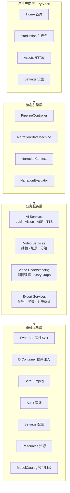
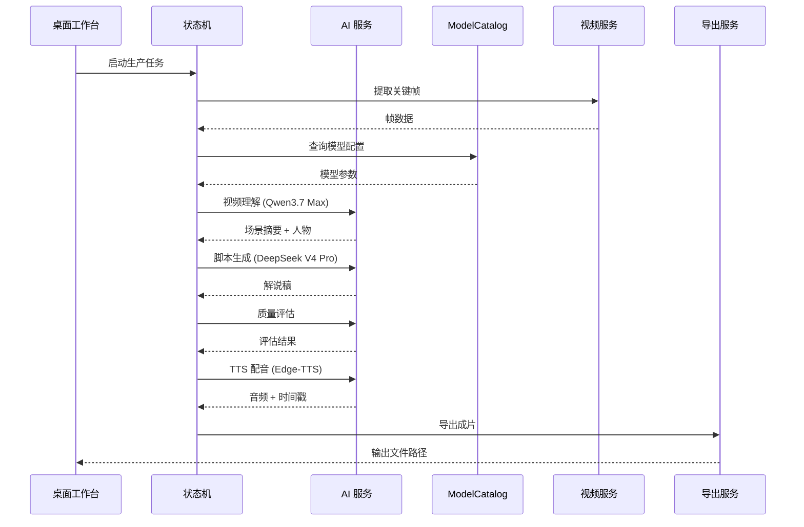
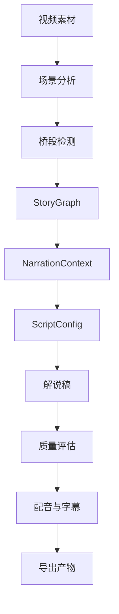

# 架构概览

SceneFab 的架构目标是让短剧/影视解说生产流程**可重复、可验证、可扩展**。系统围绕"素材理解 → 剧情上下文 → 第一人称脚本 → 配音字幕 → 导出发布"建立稳定的数据流管线，不依赖手动剪辑时间线。

## 四层架构

SceneFab 采用四层分层架构，自上而下职责清晰，层间通过明确接口通信。



### 层间职责划分

| 层级 | 职责边界 | 关键约束 |
| --- | --- | --- |
| **用户界面层** | 承载生产决策和状态反馈，不包含业务规则 | UI 仅调用 Core 层公开接口 |
| **核心引擎层** | 编排流水线状态、管理上下文、驱动生产流程 | 状态机转换必须经过评估门禁 |
| **业务服务层** | 封装 AI 推理、视频处理和导出等具体能力 | 服务失败时可降级，不阻断管线 |
| **基础设施层** | 提供事件通信、配置管理、审计和资源访问 | 模型名以 `model_catalog` 为唯一数据源 |

## 核心模块职责

| 模块 | 路径 | 职责 |
| --- | --- | --- |
| 桌面工作台 | `ui/main` | PySide6 页面，承载生产流程、资产管理和设置 |
| 解说状态机 | `pipeline` | 管理理解、剧情图谱、脚本、评估、TTS 和装配的完整生命周期 |
| 基础能力 | `core` | 事件总线、任务调度、审计日志、安全 FFmpeg、短剧桥段识别 |
| AI 服务 | `services/ai` | LLM 适配、视觉理解、ASR 语音识别、TTS 配音合成、模型目录 |
| 视频服务 | `services/video` | 帧提取、片段选择、场景分组、情绪峰值检测 |
| 剧情理解 | `services/video_understanding` | 长视频/多场景剧情理解和 StoryGraph 构建 |
| 导出服务 | `services/export` | MP4 成片、SRT 字幕、剪映草稿和平台预设导出 |
| 视觉资源 | `resources` | 应用图标、主题 QSS 和运行时视觉资源 |

## 解说流水线


### 状态机流转

解说状态机统一管理生产流程的完整生命周期：

```text
INIT → UNDERSTAND → STORYGRAPH → DRAFT → EVALUATE → HOOK_REWRITE → TTS_LENGTH_ADJUST → TTS → ASSEMBLE → DONE
```

状态机管理四类上下文，确保每个阶段都能获取完整信息：

| 上下文类型 | 内容 | 使用阶段 |
| --- | --- | --- |
| 指令上下文 | 人设、风格、平台、目标时长、短剧风格 | 脚本生成、TTS |
| 数据上下文 | StoryGraph、场景摘要、桥段识别结果 | 脚本生成、评估 |
| 历史上下文 | 已讲过的人物、剧情点和桥段 | 一致性检查 |
| 工具上下文 | Few-shot、桥段模板、质量反馈 | 脚本优化 |

## 组件交互

### AI 服务调用链



### ModelCatalog 单源真相

所有 AI 模型名称、参数和能力声明统一由 `services.ai.model_catalog` 管理：

| 消费方 | 读取方式 | 约束 |
| --- | --- | --- |
| Provider 适配器 | `provider_models(provider)` | 不得硬编码模型名 |
| 设置页面 | `settings_model_options()` | 下拉选项从 Catalog 动态生成 |
| 配置文件 | `config/llm.yaml` | `model` 字段必须存在于 Catalog |
| 文档 | 本文档 | 模型名以 Catalog 为准 |

## 短剧生产字段

短剧模式在通用解说上下文基础上增加结构化字段，确保叙事一致性：

| 字段 | 用途 | 必填 |
| --- | --- | --- |
| `content_tags` | 题材和爽点标签，用于 Hook、标题和脚本关键词 | 是 |
| `relationship_notes` | 人物关系备注，用于一致性控制 | 是 |
| `episode_index` | 连载集数，用于开头承接 | 否 |
| `previous_episode_summary` | 前情摘要，减少重复解释 | 否 |
| `next_hook_hint` | 下一集钩子，强化结尾悬念 | 否 |

## 数据流概览



## 设计原则

| 原则 | 说明 |
| --- | --- |
| **结构化优先** | 生产字段使用结构化数据模型，避免依赖文件名和自由文本 |
| **上下文共享** | 脚本生成和质量评估使用同一套 NarrationContext，确保一致性 |
| **优雅降级** | AI 服务失败时可降级到备选模型或跳过非关键步骤 |
| **导出标准化** | 导出预设和文档标准保持一致，支持多平台一键输出 |
| **UI 职责单一** | 桌面工作台只承载生产决策和状态反馈，不复制业务规则 |
| **模型单源真相** | 模型名以 `services.ai.model_catalog` 为唯一数据源 |

## 目录结构

```text
src/scenefab/
├── core/                  # 事件、任务、安全、短剧桥段、审计
├── pipeline/              # 第一人称解说状态机和上下文
├── services/
│   ├── ai/                # LLM / Vision / ASR / TTS / ModelCatalog
│   ├── video/             # 视频分析、提取、选择、分组
│   ├── video_understanding/
│   └── export/            # 成片、字幕和剪映草稿导出
├── ui/
│   ├── main/              # Home / Production / Assets / Settings
│   └── theme/             # 设计令牌 (Colors / DarkColors / Radii / Spacing) + 运行时切换 (set_theme_mode / restyle_app / ThemeAwareMixin)
└── models/                # 稳定数据模型
```

## 相关文档

- [AI 模型参考](/ai-models) — 模型选择与推荐配置
- [配置参考](/config) — 两文件配置结构详解
- [功能矩阵](/features) — 产品能力与开发状态
- [第一人称生产规范](/guide/first-person-narration-production) — 按完整生产流程执行
